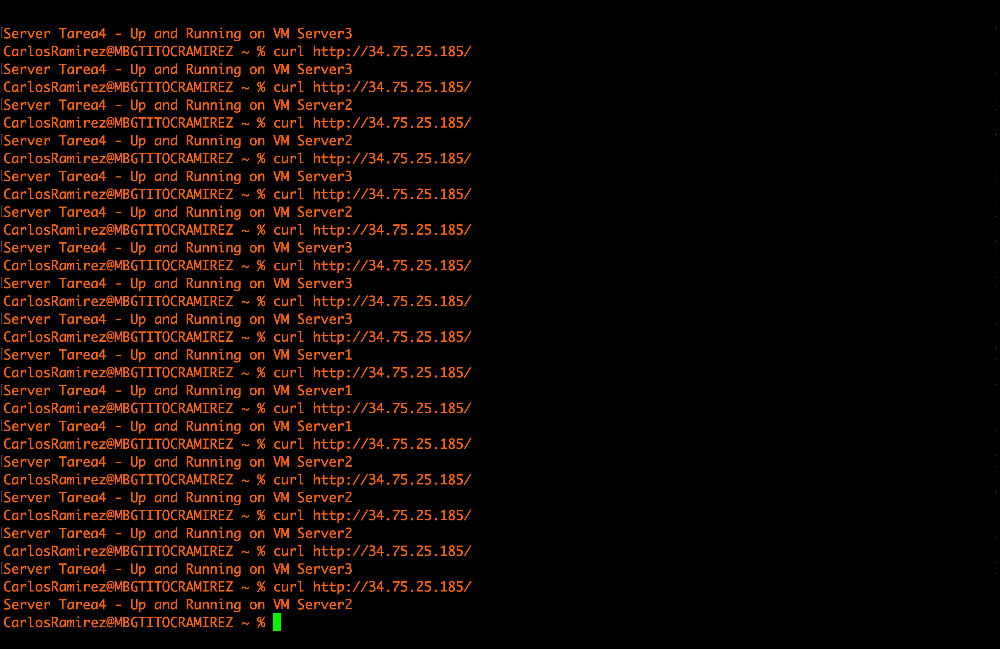

# gcp-t4

## Virtual Machines
```sh
# Comando para crear la VM 1
gcloud compute instances create app1 \
    --image-family ubuntu-pro-1804-lts \
    --image-project ubuntu-os-pro-cloud \
    --tags webapp \
    --metadata startup-script="#! /bin/bash
        sudo apt update -y; 
        sudo apt install docker.io -y; 
        sudo chmod 666 /var/run/docker.sock; 
        docker network create mysupernetwork

        docker run -d -p 3306:3306 --name mysql --network mysupernetwork racarlosdavid/mysql_gcpf_tarea3

        docker run -d -p 80:2000 --name api_gcpf_tarea4 --network mysupernetwork \
            -e MYSQL_HOST=mysql \
            -e MYSQL_USER=carlosdavid \
            -e MYSQL_PASSWORD=pass123 \
            -e MYSQL_DATABASE=tarea3 \
            -e VM_NAME=Server1 \
            racarlosdavid/api_gcpf_tarea4
    "

# Comando para crear la VM 2
gcloud compute instances create app2 \
    --image-family ubuntu-pro-1804-lts \
    --image-project ubuntu-os-pro-cloud \
    --tags webapp \
    --metadata startup-script="#! /bin/bash
        sudo apt update -y
        sudo apt install docker.io -y
        sudo chmod 666 /var/run/docker.sock
        docker network create mysupernetwork

        docker run -d -p 3306:3306 --name mysql --network mysupernetwork racarlosdavid/mysql_gcpf_tarea3

        docker run -d -p 80:2000 --name api_gcpf_tarea4 --network mysupernetwork \
            -e MYSQL_HOST=mysql \
            -e MYSQL_USER=carlosdavid \
            -e MYSQL_PASSWORD=pass123 \
            -e MYSQL_DATABASE=tarea3 \
            -e VM_NAME=Server2 \
            racarlosdavid/api_gcpf_tarea4
    "

# Comando para crear la VM 3
gcloud compute instances create app3 \
    --image-family ubuntu-pro-1804-lts \
    --image-project ubuntu-os-pro-cloud \
    --tags webapp \
    --metadata startup-script="#! /bin/bash
        sudo apt update -y
        sudo apt install docker.io -y
        sudo chmod 666 /var/run/docker.sock
        docker network create mysupernetwork

        docker run -d -p 3306:3306 --name mysql --network mysupernetwork racarlosdavid/mysql_gcpf_tarea3

        docker run -d -p 80:2000 --name api_gcpf_tarea4 --network mysupernetwork \
            -e MYSQL_HOST=mysql \
            -e MYSQL_USER=carlosdavid \
            -e MYSQL_PASSWORD=pass123 \
            -e MYSQL_DATABASE=tarea3 \
            -e VM_NAME=Server3 \
            racarlosdavid/api_gcpf_tarea4
    "

# Listado de VM creadas
gcloud compute instances list

# Creando regla INGRESS en el firewall -> Puerto 80
gcloud compute firewall-rules create www-firewall-network-lb \
    --target-tags webapp \
    --allow tcp:80

```
## LoadBalancer config
```sh
# Creacion del load balancer...
gcloud compute addresses create loadbalancer-1

# Agregando un health-check
gcloud compute http-health-checks create hc1

# Creacion de un target pool con el health check
gcloud compute target-pools create www-pool \
    --http-health-check hc1

# Agregar las instancias al target pool'
gcloud compute target-pools add-instances www-pool \
    --instances app1,app2,app3

# Agregando una regla de entrada
gcloud compute forwarding-rules create www-rule \
    --ports 80 \
    --address loadbalancer-1 \
    --target-pool www-pool

# Revisando la informacion del load balancer
gcloud compute forwarding-rules describe www-rule
```
## App Dockerizada
```sh
# Build de las imagenes
docker build --platform linux/amd64 -t racarlosdavid/mysql_gcpf_tarea3 .
docker build --platform linux/amd64 -t racarlosdavid/api_gcpf_tarea4 .

# Push al registry
docker push racarlosdavid/mysql_gcpf_tarea3
docker push racarlosdavid/api_gcpf_tarea4

# Para prueba local de los contenedores
docker network create mysupernetwork

docker run -d -p 3306:3306 --name mysql --network mysupernetwork racarlosdavid/mysql_gcpf_tarea3

docker run -d -p 80:2000 --name api_gcpf_tarea4 --network mysupernetwork \
    -e MYSQL_HOST=mysql \
    -e MYSQL_USER=carlosdavid \
    -e MYSQL_PASSWORD=pass123 \
    -e MYSQL_DATABASE=tarea3 \
    -e VM_NAME=Rocinante \
    racarlosdavid/api_gcpf_tarea4
```

```sh
# Lista las imagenes de los so disponibles
gcloud compute images list
```
## Test del LoadBalancer
